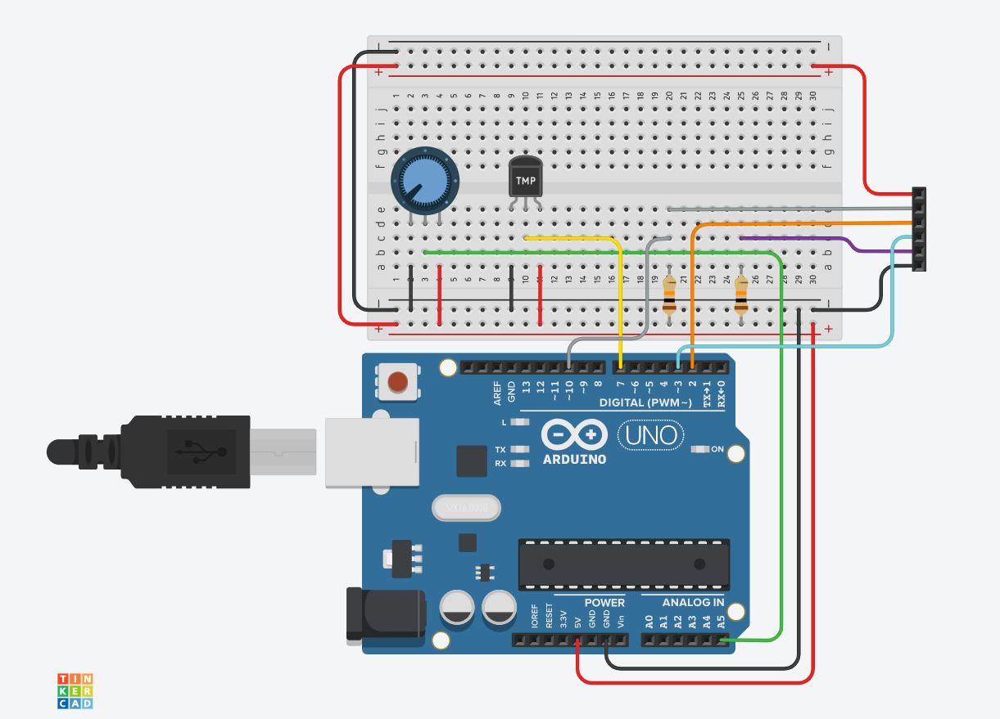

# Example for using Arduino Library For 8 Character Display SDA5708 using SPI Hardware

the image below is only to show what components are used.

For creating the example sketch one of those small 32U4 Boards was used who behave like an Arduino Leonardo.

You have to lookup yourself where those Pins are connected on your board, see description in main Readme!

Only components used what where available on Tinkercad.

- 100k -  Poti
- DHT22 - temp/humid sensor
- 10k Resistors - for Reset and LOAD 
- 6 Pin connector - to SDA5708 Display

